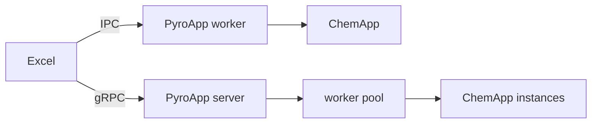

# ChemApp and licensing

This page covers the practical ChemApp runtime and licence boundary. If you are still trying to understand what ChemApp is relative to FactSage and PyroApp, read [PyroApp, FactSage, ChemApp and ChemSage](learn/factsage-chemapp-pyroapp.md) first.

ChemApp is a thermochemical equilibrium library from GTT Technologies. In normal PyroApp use you do not operate ChemApp directly: PyroApp prepares the calculation from worksheet values, ChemApp solves the thermodynamic problem, and PyroApp returns the requested results to Excel.

## Why PyroApp uses a worker process

ChemApp is a native stateful library. PyroApp does not load it directly into Excel. In local IPC mode the XLL starts a separate PyroApp worker process, and the worker loads ChemApp. This separates Excel from native-library state, bitness issues, and failures.

In remote mode, the XLL talks to a PyroApp gRPC server and the server schedules work on isolated ChemApp worker processes.

## ChemApp is not used for open-DAT inspection

Current PyroApp reads and edits open `.DAT` parameter data using `chemsage-parser` through a small local ABI DLL. This is why LIST/GET/SET operations do not need a ChemApp call and why they cannot expose encrypted CST parameter contents.

## Licence requirements

PyroApp does not include a right to use ChemApp. Local calculations require a compatible ChemApp distribution and licence. Remote calculations require access to a server whose operator has configured the appropriate licensed runtime.

Protected `.CST` files can also have user/licence restrictions imposed by their provider. PyroApp cannot bypass those restrictions.

## Bitness

Native libraries must match the process that loads them. In the PyroApp architecture, ChemApp is loaded by the worker rather than Excel, but the release package still has to pair a compatible worker and ChemApp library. Use the distribution prepared for your Excel/runtime architecture.

For the ChemApp API itself, consult the official GTT-Technologies ChemApp documentation supplied for the version you use.
