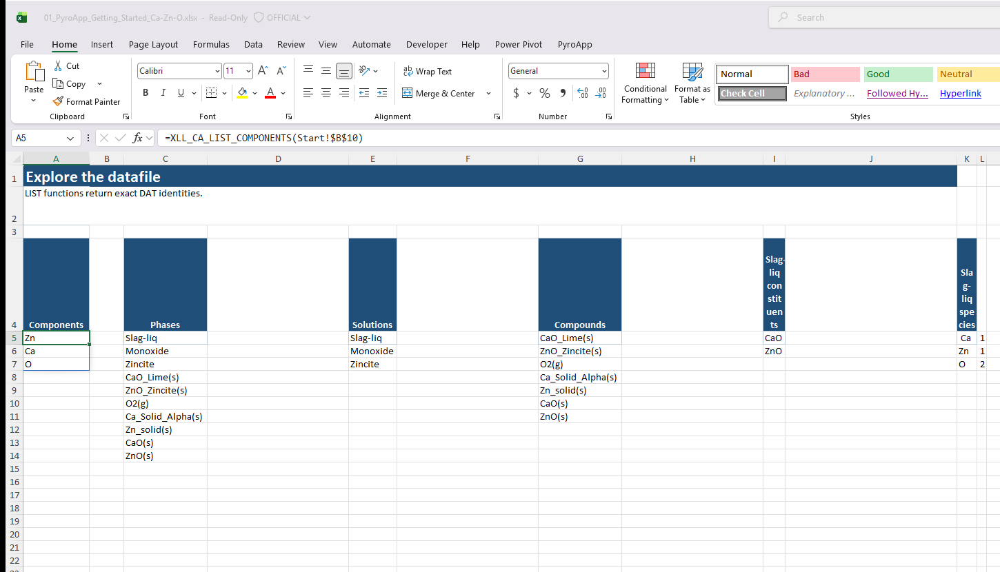

# XLL_CA_LIST_COMPONENTS

**Availability:** stable, open-DAT only.

Lists the system components declared by a ChemSage/ChemApp DAT file, in datafile order.

## Syntax

```excel
=XLL_CA_LIST_COMPONENTS(datafile,[update_token])
```

## Returns

A one-column dynamic array of component names.

## Example

```excel
=XLL_CA_LIST_COMPONENTS($B$1)
```

Use the returned spelling when constructing `IA`, `XP`, or other component-addressed `XLL_CA_CALCULATE` headers. This function parses the DAT locally and never uploads the file.
## Live Excel example

`XLL_CA_LIST_COMPONENTS` spills exact component identities. The same workbook sheet groups the related phase, solution, and compound lists so their hierarchy remains visible.


