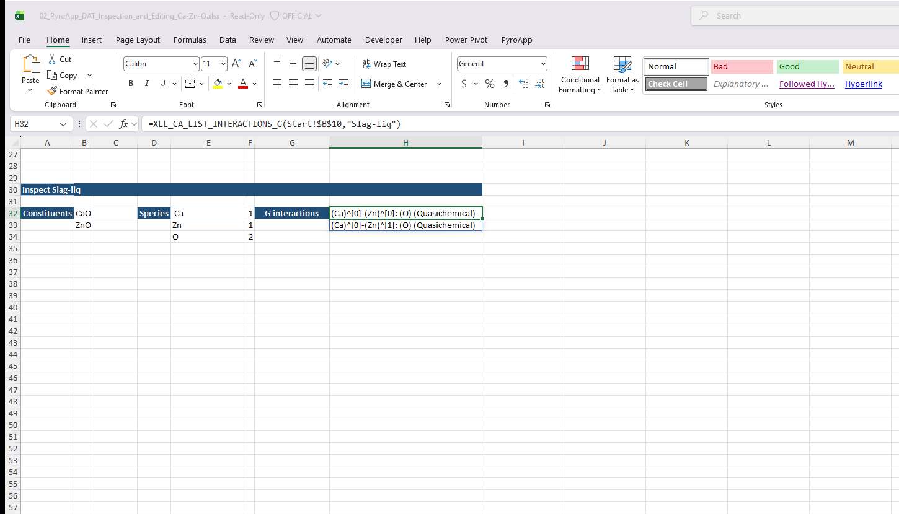

# XLL_CA_LIST_INTERACTIONS_G

**Availability:** stable, open-DAT only.

Lists ordinary (non-magnetic) ChemApp-style interactions for the requested solution phases.

## Syntax

```excel
=XLL_CA_LIST_INTERACTIONS_G(datafile,phases,[update_token])
```

## Returns

A one-column spill range of ChemApp-style interaction strings derived from the
parsed DAT model, for example:

```text
(Al)^[0]-(Ca)^[0]: (O) (Guts)
```

!!! important "Use the returned interactions"
    Pass these values directly to interaction GET/SET functions. The old
    comma-prefixed `G:`, `Q:`, `B:`, `H:`, and `R:` forms are not supported.
    Multi-digit powers are preserved by the DAT parser.

For magnetic interactions use [`XLL_CA_LIST_INTERACTIONS_M`](ca_list_interactions_m.md).

## Live Excel example

Use the exact string returned by the spill for a later interaction GET or SET call. Do not type a reconstructed interaction name.


