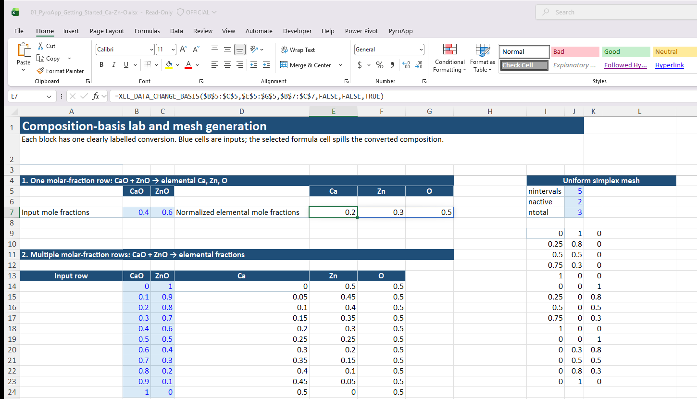
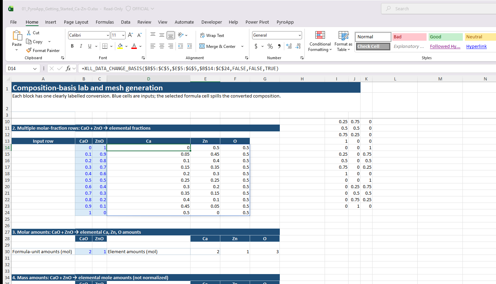
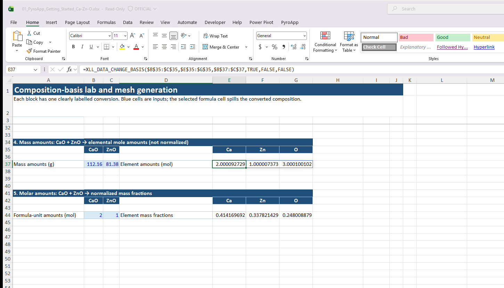

# XLL_DATA_CHANGE_BASIS

**Availability:** stable utility in the current PyroApp interface.

Converts composition rows from one independent chemical-formula basis to another, optionally converting between mole and mass bases and optionally normalizing the result.

## Syntax

```excel
=XLL_DATA_CHANGE_BASIS(basis_initial,basis_final,data_initial,[isweight_initial],[isweight_final],[is_fraction])
```

| Argument | Meaning |
|---|---|
| `basis_initial` | Formula units describing columns of `data_initial`. |
| `basis_final` | Desired output formula basis. |
| `data_initial` | Rows of compositions/amounts. |
| `isweight_initial` | TRUE if the input values are a mass/weight basis; default FALSE. |
| `isweight_final` | TRUE for a mass/weight output basis; default FALSE. |
| `is_fraction` | TRUE to normalize each output row to sum to one; default FALSE. |

## Returns

A dynamic array with one output row for each input row, in `basis_final` order.

The basis labels are chemical formula units, not arbitrary column labels. They can be compounds such as `CaO`, `SiO2`, and `FeO`, or elements, provided that the requested conversion is chemically well-defined.

## Read the three switches as a sentence

The last three arguments answer three different questions:

| Question | `FALSE` | `TRUE` |
|---|---|---|
| What do the input values mean? | molar values | mass/weight values |
| What should the output values mean? | molar values | mass/weight values |
| Should every output row be scaled to one? | keep amounts | return fractions |

For example, this formula reads as: “convert CaO/ZnO **mass amounts** to Ca/Zn/O **molar amounts**, and **do not normalize**.”

```excel
=XLL_DATA_CHANGE_BASIS($B$35:$C$35,$E$35:$G$35,$B$37:$C$37,TRUE,FALSE,FALSE)
```

## Start with the worked workbook

The [Getting Started workbook](../tutorials/workbooks.md#getting-started-ca-zn-o) contains five labelled, live cases on **Basis + utilities**:

1. one CaO/ZnO molar-fraction row to normalized Ca/Zn/O fractions;
2. eleven composition rows in a single spill calculation;
3. CaO/ZnO molar amounts to elemental amounts, retaining scale;
4. CaO/ZnO mass amounts to elemental molar amounts, retaining amounts; and
5. CaO/ZnO molar amounts to normalized elemental mass fractions.

Select the formula anchor in each block to see the complete call in Excel’s Formula Bar. The blue cells are deliberately separated from the spilled result so that the source basis, target basis, and scientific meaning stay visible.

The CaO/ZnO-to-Ca/Zn/O examples are deliberately one-way. A direct elemental-to-oxide request has more elemental columns than oxide formula units and is not a uniquely determined basis transform in the current function. Keep the original oxide basis for that direction, or choose a basis pair whose transformation is unambiguous.

## Useful checks

- A fraction result should sum to approximately one across each non-empty row.
- An amount result should retain its physically meaningful scale; it should not be expected to sum to one.
- Tiny negative values caused by numerical round-off can occur near zero, but a meaningful negative component usually signals an unsuitable basis or inconsistent source row.
- Use the components returned by `XLL_CA_LIST_COMPONENTS` when the result will feed `XLL_CA_CALCULATE`.

## Real Excel examples

The selected anchors in the **Basis + utilities** sheet make the three Boolean arguments auditable in the Formula Bar. Blue cells are the input range; the dynamic array begins at the selected formula cell.



*CaO and ZnO molar fractions become normalized Ca, Zn and O fractions (`FALSE`, `FALSE`, `TRUE`).*



*One call spills eleven converted rows. The output has three elemental columns although the source has two oxide columns.*



*With `isweight_initial=TRUE`, `isweight_final=FALSE`, and `is_fraction=FALSE`, scale is retained as elemental molar amounts.*
