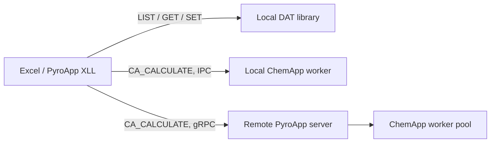

# PyroApp

**PyroApp brings ChemApp thermodynamic calculations and ChemSage datafile tools into Microsoft Excel.** It is designed for engineers and researchers who want spreadsheet-native thermodynamic workflows without writing a ChemApp program for every calculation.

PyroApp is an Excel-DNA add-in with a C# Excel front end and Rust backends. It has two deliberately separate jobs:

- **Read and edit open `.DAT` datafiles locally.** LIST, GET and SET functions use a pure Rust datafile library beside the XLL. They do not load ChemApp and do not upload the datafile.
- **Run equilibrium calculations through ChemApp.** `XLL_CA_CALCULATE` can use a local isolated ChemApp worker through IPC, or a remote PyroApp server through gRPC.

## Start here

If you know some thermodynamics or FactSage but are new to PyroApp, begin with the conceptual pages before copying formulas:

1. Read [What is PyroApp?](learn/what-is-pyroapp.md).
2. Read [PyroApp, FactSage, ChemApp and ChemSage](learn/factsage-chemapp-pyroapp.md).
3. Read [How an equilibrium calculation works](learn/equilibrium-calculation.md).
4. Install PyroApp using [Install PyroApp](installation-2.0.md).
5. Work through the [Quickstart](quickstart.md) and [Practical tutorials](tutorials/index.md).
6. Use the [Function reference](function-reference.md) while building your own workbook.

!!! note "Current PyroApp function names"
    Current Excel formulas use the `XLL_` prefix, for example `XLL_CA_LIST_PHASES` and `XLL_CA_CALCULATE`. Older PyroApp 1.x workbooks used unprefixed names such as `CA_LIST_PHASES`. This documentation shows the current PyroApp Excel names.

## What you need

For local equilibrium calculations you need a ChemApp runtime that is compatible with the PyroApp package and your licence. For remote calculations you need access to a configured PyroApp server. Open-DAT inspection and editing do not need ChemApp because they use the local parser.

PyroApp relies on modern Excel dynamic arrays. Most functions return spill ranges rather than a single scalar.

## Safety when editing datafiles

`XLL_CA_SET_*` functions modify the specified `.DAT` file at the same path. Writes are validated and replaced atomically, but thermodynamic parameter changes are still real file changes. Keep source databases under version control or maintain a backup before experimental edits.
