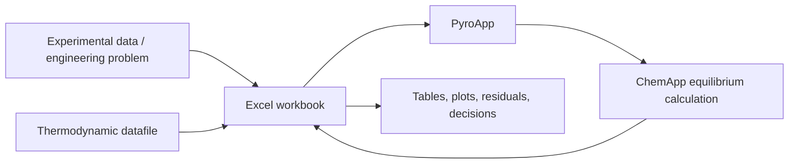

# What is PyroApp?

PyroApp is a thermodynamic calculation environment built around Microsoft Excel. Its purpose is simple: let an engineer or researcher set up, repeat, inspect, and compare thermodynamic calculations in an ordinary spreadsheet without having to write a standalone ChemApp program.

If you already know FactSage, the easiest first approximation is:

> PyroApp lets you express many Equilib-like calculations as Excel tables and formulas.

That comparison is useful, but it is not the whole story. PyroApp is not a copy of FactSage, it is not a thermodynamic database, and it is not the equilibrium solver itself. PyroApp connects three things that already make sense to many researchers:

1. an Excel workbook, where compositions, temperatures, experimental targets, plots, residuals, and model parameters are visible;
2. a ChemSage/ChemApp datafile containing the thermodynamic description of the system;
3. ChemApp, which performs the equilibrium calculation.

The result is a workflow in which the spreadsheet becomes the laboratory notebook and calculation interface.

## The problem PyroApp is trying to solve

A thermodynamic calculation engine is most useful when it can be repeated many times.

A single equilibrium calculation is easy to perform interactively in a graphical program. A researcher can select a database, choose phases, enter a temperature and composition, press **Calculate**, and inspect the result. The difficulty starts when the work becomes systematic:

- calculate 500 compositions rather than one;
- compare three different phase selections;
- reproduce the same calculation after changing a database parameter;
- calculate a liquidus temperature for every experimental composition in a paper;
- compare initial, current, and fitted model predictions;
- create a derivative matrix for a set of model parameters;
- keep the calculation definition next to the experimental data and plots;
- hand the whole analysis to another researcher in a form they can inspect.

Those tasks are naturally tabular. Excel is already widely used for experimental data, calculation sheets, plots, error analysis, and engineering reporting. PyroApp adds thermodynamic functions to that environment.

The original PyroApp was created for exactly this reason: ChemApp is powerful, but using it directly normally means writing a program. Most chemical engineers and experimental thermodynamicists do not want to maintain a C, Fortran, Python, or other software project merely to calculate a phase equilibrium. PyroApp exposes the useful calculation concepts as spreadsheet functions instead.

## What PyroApp actually does

From a user's point of view, PyroApp has four main jobs.

### 1. Explore a thermodynamic datafile

Before calculating anything, you can ask the workbook what is inside a datafile:

- system components;
- phases;
- solution phases;
- stoichiometric compounds;
- phase constituents;
- sublattice species;
- excess interaction terms.

This is useful because thermodynamic names are exact identities. A phase called `SLAG`, `SLAG#1`, `liquid`, or `gas_ideal` is not interchangeable merely because the names look similar. A good PyroApp workbook obtains names from the datafile and then references those cells rather than relying on memory.

### 2. Perform equilibrium calculations

The main calculation function, `XLL_CA_CALCULATE`, accepts a table of thermodynamic conditions and returns a table of requested properties.

Each row of the input table represents one thermodynamic problem. For example:

- 1400 °C, 1 bar, composition A;
- 1400 °C, 1 bar, composition B;
- 1450 °C, 1 bar, composition B;
- find the temperature at which a named solid first forms;
- calculate an invariant equilibrium while only selected phases are available.

The output can contain whatever is relevant to the study: temperature, phase amount, activity, phase composition, enthalpy, Gibbs energy, number of stable phases, error code, and so on.

This is the core of the Equilib-like part of PyroApp.

### 3. Inspect and change parameters in an open DAT file

For thermodynamic assessment and optimization, calculating equilibrium is only half the job. The model parameters must also be visible.

With an open ChemSage/ChemApp `.DAT` file, PyroApp can read supported values such as:

- compound and constituent enthalpy and entropy terms;
- heat-capacity coefficients and temperature ranges;
- stoichiometry and molar masses;
- ordinary excess interactions;
- magnetic interaction parameters.

Supported values can also be changed from Excel.

This makes it possible to keep a parameter table, target calculations, residuals, and plots in one workbook. The workbook can therefore act as a transparent optimization workspace rather than a black-box optimizer.

### 4. Support simple continuous optimization

PyroApp includes spreadsheet tools for the common local-linear optimization cycle:

```text
current model
    ↓
calculate target properties
    ↓
target - current = residuals
    ↓
calculate derivatives with respect to model parameters
    ↓
solve a weighted linear least-squares step
    ↓
apply a controlled parameter change
    ↓
recalculate the real thermodynamic model
```

The important word here is **controlled**. PyroApp can solve the numerical step, but it does not decide whether an interaction parameter is chemically meaningful, whether a new phase model is justified, or whether a lower RMS error has damaged the extrapolation of the database. Those remain thermodynamic-modeling decisions.

## A PyroApp workbook is a calculation definition

A useful way to think about PyroApp is that the workbook contains the definition of the calculation.

In a graphical equilibrium program, part of the calculation definition lives in dialog boxes and module state. In PyroApp, the important parts can be visible as cells:

- the datafile path;
- composition;
- temperature and pressure;
- phase selection;
- target conditions;
- requested outputs;
- parameter values;
- experimental targets;
- residuals and weights.

That makes a workbook inspectable. Another researcher can see not only the final graph but also how each point was calculated.

It also makes the analysis repeatable. Change a composition table, a parameter, or a temperature range and the same calculation structure can be reused.

## Why PyroApp uses tables

Thermodynamic studies usually involve families of related calculations. It is therefore better to think in tables than in isolated cells.

A typical calculation sheet has:

```text
input header
input rows
          ───────► XLL_CA_CALCULATE ───────► output table
output header
```

The three-row input and output headers describe what each column means. One column may be temperature, another pressure, another the incoming amount of Ca, another the activity of a constituent, and so on.

This table design has two advantages.

First, it mirrors how experimental and engineering data are normally organized. Second, it keeps similar calculations together. Instead of building hundreds of unrelated formulas, one formula can describe a complete calculation table and return a dynamic array.

## What PyroApp does not replace

PyroApp is deliberately narrower than FactSage as a complete software suite.

It does not try to replace the graphical database-development environment of the FactSage **Compound** and **Solution** modules. It does not provide the full interactive **Phase Diagram** environment. It does not provide commercial thermodynamic databases, and it does not grant a ChemApp licence.

FactSage remains extremely useful for:

- selecting and combining database sources;
- interactively exploring a new system;
- building or maintaining full FactSage databases;
- inspecting compound records through the Compound module;
- creating or editing solution databases through the Solution module;
- producing dedicated Phase Diagram calculations and Figure files;
- exporting a selected thermodynamic system to a ChemSage/ChemApp datafile.

PyroApp becomes especially useful once you know what system you want to study and want to perform the calculations repeatedly, transparently, and in connection with experimental data.

## What PyroApp does not replace in ChemApp

ChemApp is the equilibrium engine. PyroApp does not reproduce its Gibbs-energy minimization equations.

When you request an equilibrium calculation, PyroApp prepares the conditions, loads the selected thermodynamic data into ChemApp, asks ChemApp to solve the problem, and returns the requested results to Excel.

For ordinary users this distinction is mostly invisible, but it is important conceptually:

- **ChemApp calculates the equilibrium.**
- **The datafile defines the thermodynamic model.**
- **PyroApp defines how the spreadsheet describes, repeats, and uses the calculation.**

This is why a PyroApp result is only as good as the selected thermodynamic data and the physical setup of the calculation.

## Open datafiles and protected datafiles

An open `.DAT` file and a protected `.CST` file can both be calculation inputs when the licensed ChemApp environment permits them, but they are not equally transparent.

An open DAT can be inspected and, for supported parameter families, edited. A protected CST is intentionally opaque. PyroApp can use it for equilibrium calculation, but it cannot turn protected model parameters into editable spreadsheet values.

For this reason, thermodynamic optimization normally requires an open DAT.

## The current PyroApp is not the old Python version

Older PyroApp workbooks used a Python/xlwings add-in and usually required macro-enabled workbooks, an `xlwings.conf` sheet, a configured Python interpreter, and Python-side calculation code.

Current PyroApp is installed as a compiled Excel add-in. Its worksheet functions use the `XLL_` prefix, for example:

```text
XLL_CA_LIST_PHASES
XLL_CA_CALCULATE
XLL_CA_GET_INTERACTION_PARAMETERS_G
XLL_LINEAR_REGRESSION
```

A normal scientific user does not need to install Python, edit source code, or understand the internal software components.

The legacy material is still valuable because it contains years of practical knowledge about thermodynamic calculations and optimization. The current documentation preserves those scientific ideas while replacing the old implementation-specific instructions.

## A good mental model

The most useful summary is:



PyroApp is the bridge between the visible engineering workflow in Excel and the thermodynamic calculation engine.

If you are new to the ecosystem, continue with [PyroApp, FactSage, ChemApp and ChemSage](factsage-chemapp-pyroapp.md).
