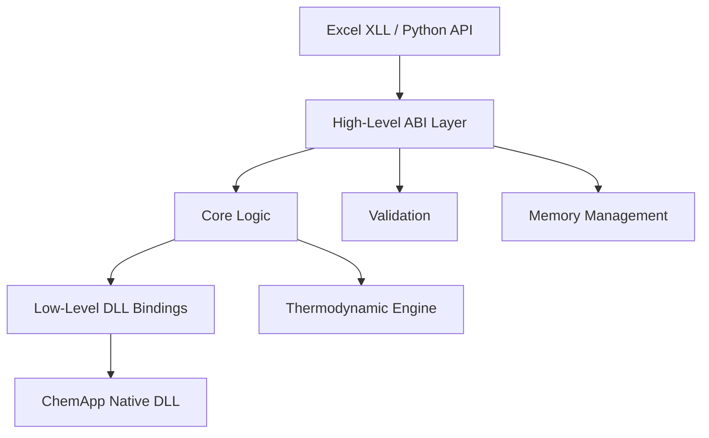

# PYROAPP ARCHITECTURE 

[TODO REPLACE THE DUMMY]

```mermaid
graph TD

    A[Excel XLL / Python API] --> B[High-Level ABI Layer]
    B --> C[Core Logic]
    C --> D[Low-Level DLL Bindings]
    D --> E[ChemApp Native DLL]

    B --> F[Validation]
    B --> G[Memory Management]
    C --> H[Thermodynamic Engine]
```