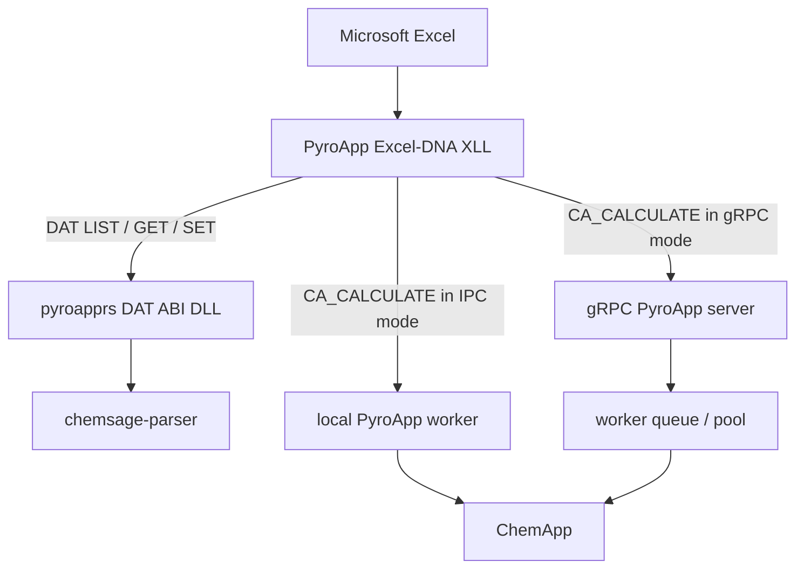

# PyroApp 2 architecture

PyroApp 2 separates **datafile editing** from **thermodynamic execution**.

## Local DAT path

LIST, GET, SET and DAT dimension operations are handled by the architecture-matched `pyroapprs_dat_abi` DLL loaded beside the XLL. It is a pure datafile component and has no ChemApp dependency. It uses `chemsage-parser` to parse semantic DAT structures.

This has three practical consequences:

1. DAT inspection/editing is fast and local.
2. DAT parameter functions work even when no ChemApp worker is running.
3. Protected CST data cannot be inspected or edited by these functions.

SET operations are transactional and replace the specified DAT file atomically after validation.

## Connection configuration

The **PyroApp** Ribbon owns the calculation transport for the entire Excel process. It stores a validated Local (IPC) or Remote (gRPC) selection and remote URL in per-user settings, independently of any workbook. A Ribbon change creates a new asynchronous execution identity: work already captured by a formula keeps its original transport and endpoint, while later formulas use the applied setting. Legacy `XLL_PYROAPP_USE_*` formulas remain non-mutating compatibility markers.

## Local IPC calculation path

With IPC selected, the XLL communicates with a bounded per-Excel pool of one to six separate workers. A lease gives one formula call one sequential ChemApp context; requests in the same worker never overlap, while independent Excel formulas can use different workers concurrently. The worker executable and selected ChemApp runtime match the Excel/XLL architecture. Excel never loads ChemApp directly.

The installer records the existing licensed runtime in `pyroapp.runtime.json`; managed deployments may instead set `PYROAPP_CHEMAPP_HOME`. The product does not package or redistribute ChemApp libraries, datafiles, licences, or dongles.

On Excel shutdown the XLL stops owned workers. Each worker also monitors the Excel process ID and exits if Excel disappears after a crash, so a local server process is not left running.

## Remote gRPC calculation path

With gRPC selected, only `CA_CALCULATE` synchronizes the datafile. The client identifies the exact content/format; the server caches a temporary immutable copy and schedules the calculation on an isolated worker pool.

The server is a broker rather than the ChemApp engine itself. Worker processes own ChemApp instances.

## Privacy boundary

Changing the calculation transport does **not** redirect DAT GET/SET operations. Those remain local. A remote server receives a datafile only when a remote `XLL_CA_CALCULATE` needs it.

## Uneven calculation times

Individual equilibrium rows can take very different amounts of time. Dynamic row assignment is deferred future server work; this release sends one complete `CA_CALCULATE` table to one worker and never statically partitions it. Current local IPC schedules independent **formula requests**, not rows inside one table. Order-dependent controls such as the legacy `USEFORNEXT` option and experimental `FORMATION1` are rejected by the current calculation planner.
