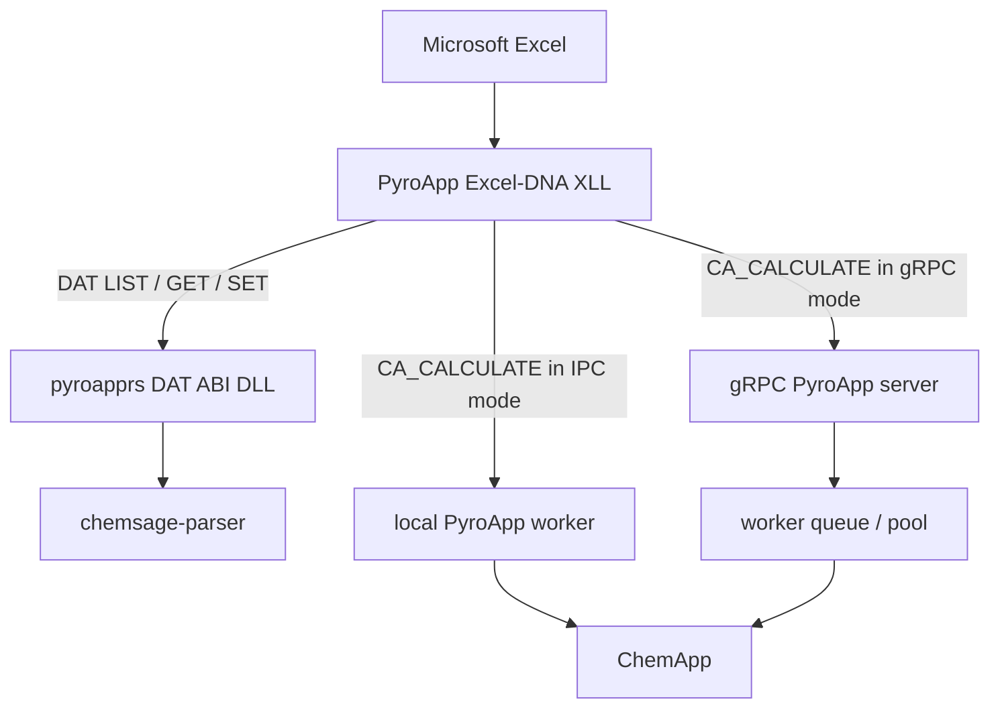

# PyroApp 2 architecture

PyroApp 2 separates **datafile editing** from **thermodynamic execution**.

## Local DAT path

LIST, GET, SET and DAT dimension operations are handled by the architecture-matched `pyroapprs_dat_abi` DLL loaded beside the XLL. It is a pure datafile component and has no ChemApp dependency. It uses `chemsage-parser` to parse semantic DAT structures.

This has three practical consequences:

1. DAT inspection/editing is fast and local.
2. DAT parameter functions work even when no ChemApp worker is running.
3. Protected CST data cannot be inspected or edited by these functions.

SET operations are transactional and replace the specified DAT file atomically after validation.

## Local IPC calculation path

With IPC selected, the XLL communicates with one separate local worker. The worker owns the ChemApp native state and receives the original local datafile path. Excel never loads ChemApp directly.

## Remote gRPC calculation path

With gRPC selected, only `CA_CALCULATE` synchronizes the datafile. The client identifies the exact content/format; the server caches a temporary immutable copy and schedules the calculation on an isolated worker pool.

The server is a broker rather than the ChemApp engine itself. Worker processes own ChemApp instances.

## Privacy boundary

Changing the calculation transport does **not** redirect DAT GET/SET operations. Those remain local. A remote server receives a datafile only when a remote `XLL_CA_CALCULATE` needs it.

## Uneven calculation times

Individual equilibrium rows can take very different amounts of time. The architecture is designed for dynamic work assignment on a server rather than fixed equal row partitions, while preserving original output row order. Order-dependent controls such as the legacy `USEFORNEXT` option are therefore rejected by the current calculation planner.
