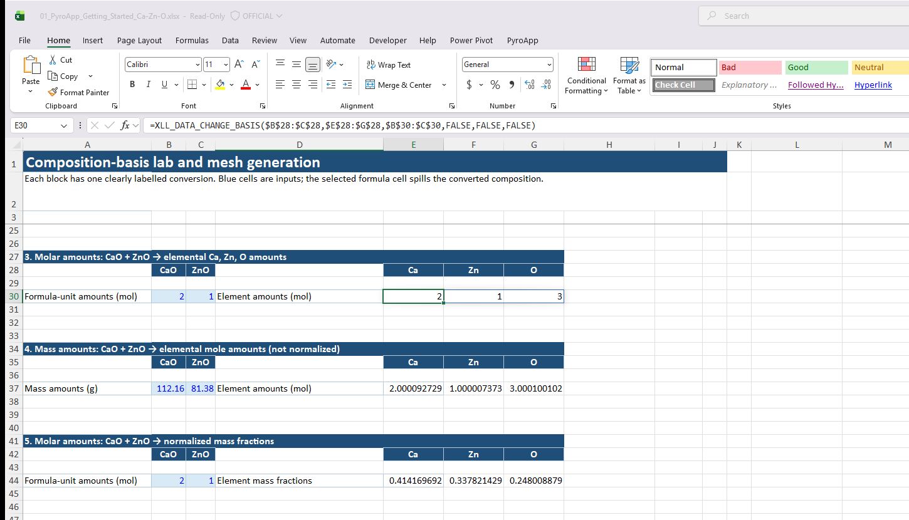
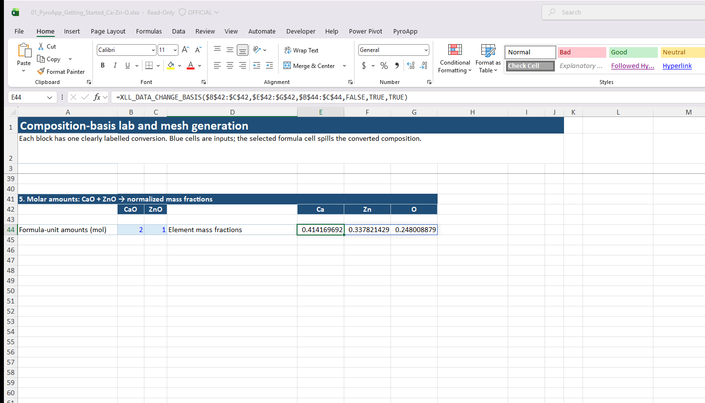

# Tutorial: convert composition bases

Experimental compositions are often reported in a convenient oxide or compound basis, while equilibrium input is most robust in the datafile's system-component basis. The **Basis + utilities** sheet in the [Getting Started workbook](workbooks.md#getting-started-ca-zn-o) turns this into a sequence of small, inspectable Excel examples.

The legacy example 01 taught this operation.

## Function

```excel
=XLL_DATA_CHANGE_BASIS(basis_initial,basis_final,data_initial,isweight_initial,isweight_final,is_fraction)
```

## Example: oxide basis to system components

Suppose `B4:C4` contains:

```text
CaO | ZnO
```

and `E4:G4` contains the system components:

```text
Ca | Zn | O
```

Put one CaO/ZnO composition in `B7:C7`, then enter in `E7`:

```excel
=XLL_DATA_CHANGE_BASIS($B$5:$C$5,$E$5:$G$5,$B$7:$C$7,FALSE,FALSE,TRUE)
```

The result spills as normalized Ca-Zn-O molar fractions. Select `E7`, rather than a result cell, when checking the formula in Excel’s Formula Bar.

## Five cases worth comparing

The downloadable workbook deliberately keeps these cases separate:

| Case | Input meaning | Output meaning | Normalize? | Why it matters |
|---|---|---|---|---|
| One row | CaO/ZnO molar fractions | Ca/Zn/O molar fractions | Yes | Smallest useful conversion. |
| Multiple rows | CaO/ZnO molar fractions | Ca/Zn/O molar fractions | Yes | One dynamic-array call converts a whole composition series. |
| Molar amounts | CaO/ZnO molar amounts | Ca/Zn/O molar amounts | No | Keeps the physical amount instead of turning it into a fraction. |
| Mass to mole | CaO/ZnO grams | Ca/Zn/O moles | No | Separates amount conversion from normalization. |
| Mole to mass | CaO/ZnO moles | Ca/Zn/O mass fractions | Yes | Matches a common reporting basis. |

Rows without normalization are *amounts*, not fractions. That distinction matters when the converted values become `IA` inputs to an equilibrium calculation.

`XLL_DATA_CHANGE_BASIS` needs a uniquely solvable transformation. In this CaO/ZnO example, converting from two oxide formula units to three elemental quantities is supported; the reverse request is not generally unique. Do not use an elemental-to-oxide formula unless the selected bases make that inverse transform unambiguous.

## Boolean arguments

| Argument | Meaning |
| --- | --- |
| `isweight_initial` | TRUE for weight input, FALSE for molar input |
| `isweight_final` | TRUE for weight output, FALSE for molar output |
| `is_fraction` | TRUE to normalize each output row |

A good workbook keeps the reported composition, the human-readable basis, and the system-component amounts in visibly separate blocks.

## Checks

- Converted values should not contain meaningful negative amounts.
- If `is_fraction=TRUE`, valid output rows should sum to approximately 1.
- The final basis should agree with `XLL_CA_LIST_COMPONENTS`.
- Do not change a blue input cell in the middle of a spilled result; edit the input block, then let the dynamic array recalculate.

## Next

Use the converted values in [First equilibrium table](first-equilibrium.md) or [Temperature and composition sweeps](equilibrium-sweep.md).

## See the five cases in Excel

The [Getting Started workbook](workbooks.md#getting-started-ca-zn-o) shows all five transformations as separate input/result blocks. The last two make the distinction between amount and fraction visible.



*No normalization means the output is an amount, so it must not be interpreted as a fraction.*



*Changing the output basis to mass and enabling normalization produces mass fractions that sum to one.*
