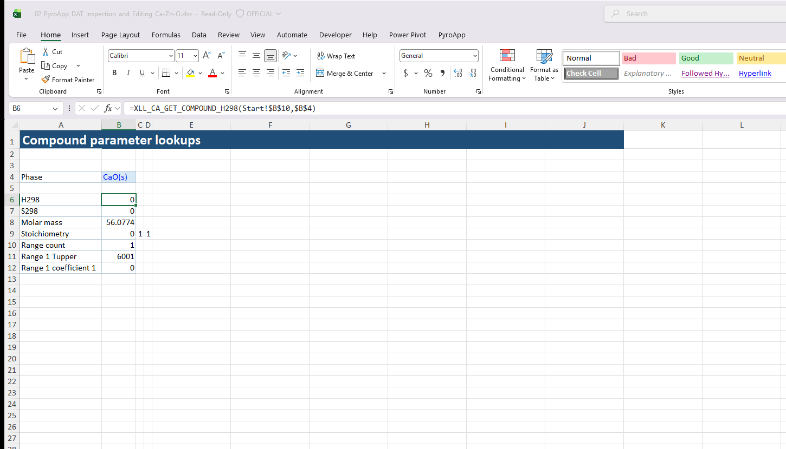
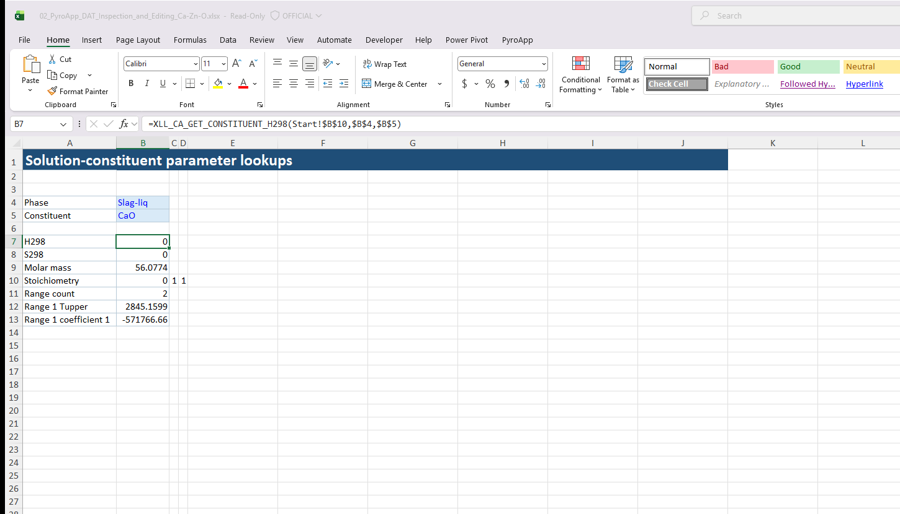
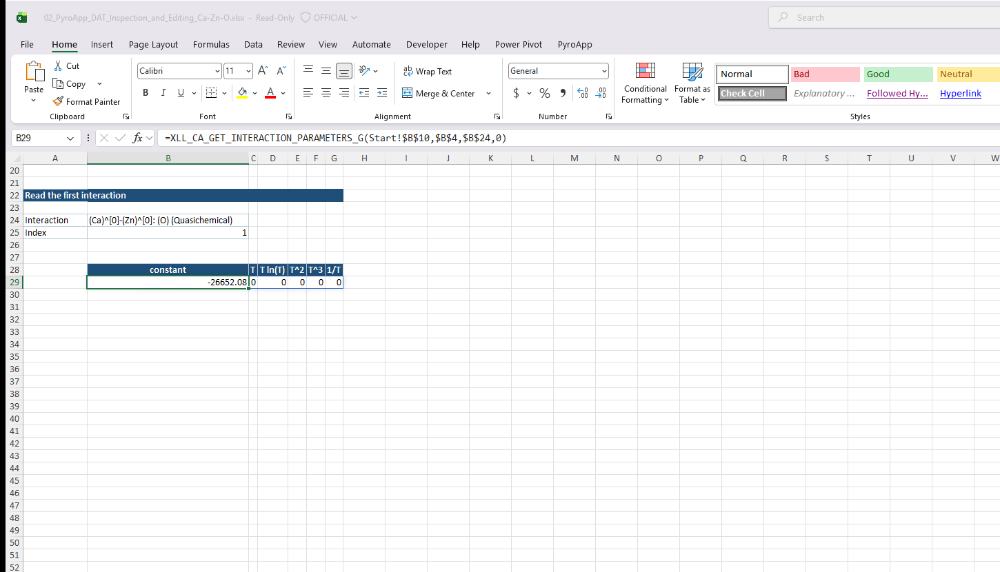
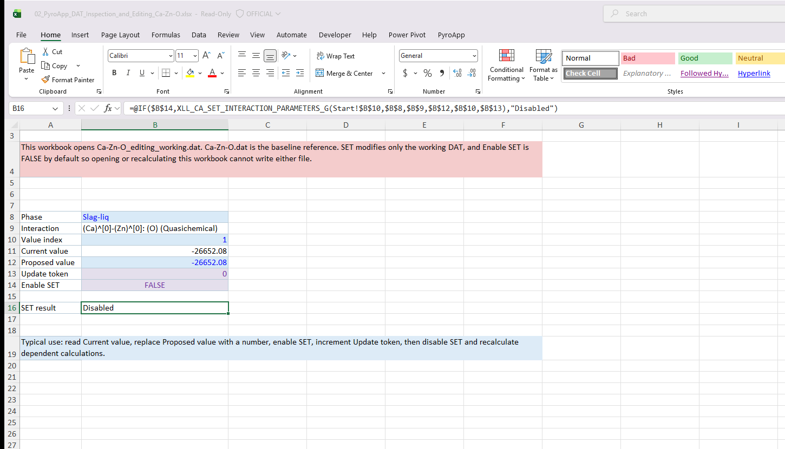
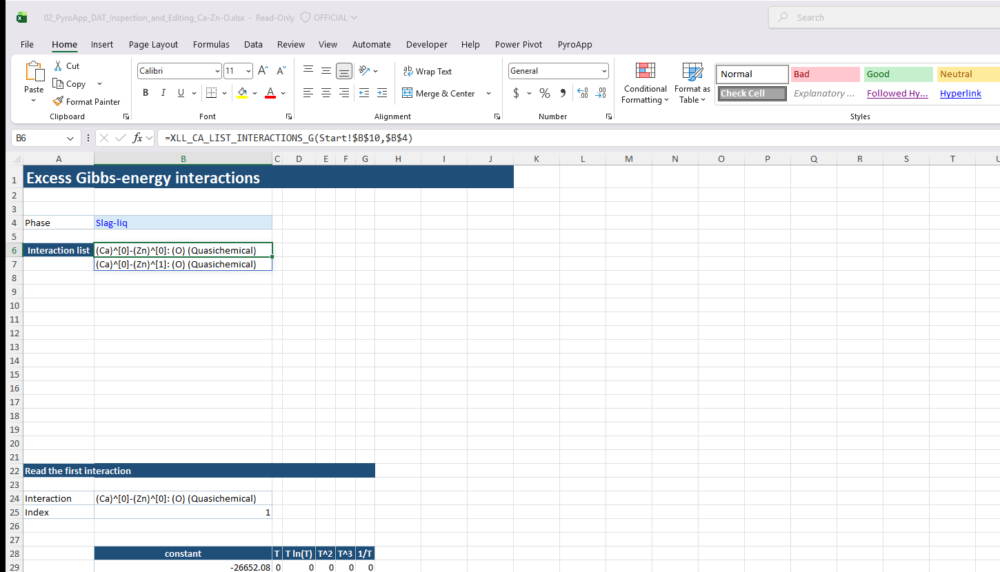

# Tutorial: inspect and edit DAT model parameters

Thermodynamic optimization requires both equilibrium calculations and controlled access to model parameters.

This tutorial replaces legacy example 05.

!!! warning "Work on a copy"
    SET functions modify the selected DAT file. Keep an untouched reference copy and optimize a dedicated working DAT.

## Compounds

```excel
=XLL_CA_LIST_COMPOUNDS($B$2)
```

Then, for a spilled list such as `D5#`:

```excel
=XLL_CA_GET_COMPOUND_H298($B$2,D5#)
```

```excel
=XLL_CA_GET_COMPOUND_S298($B$2,D5#)
```

```excel
=XLL_CA_GET_COMPOUND_RANGE_COUNT($B$2,D5#)
```

Use `XLL_CA_GET_COMPOUND_TUPPER` and `XLL_CA_GET_COMPOUND_CP` for Cp ranges and coefficients. Excel range/coefficient indices are 1-based.

## Solution constituents

Choose a phase returned by `XLL_CA_LIST_SOLUTIONS`:

```excel
=XLL_CA_LIST_CONSTITUENTS($B$2,E5)
```

Then use the corresponding constituent H298, S298, range-count, TUPPER and CP getters. Constituent functions require both phase and constituent identity.

## Excess interactions

Ordinary Gibbs-energy and magnetic interactions are distinct families:

```excel
=XLL_CA_LIST_INTERACTIONS_G($B$2,E5)
```

```excel
=XLL_CA_LIST_INTERACTIONS_M($B$2,E5)
```

Reference the returned interaction string directly. Do not reconstruct it by hand.

For ordinary interactions:

```excel
=XLL_CA_GET_INTERACTION_INDICES($B$2,E5,H5#)
```

```excel
=XLL_CA_GET_INTERACTION_PARAMETERS_G($B$2,E5,H5#,0)
```

The `0` request returns the six ordinary G coefficients as a row. Use `1` through `6` when you need only one term. The [DAT Inspection workbook](workbooks.md#dat-inspection-ca-zn-o) shows both the selected interaction identity and the coefficient spill together.

Magnetic interaction getters are only meaningful for a DAT that actually lists magnetic records. For such a file, use the returned M identities with:

```excel
=XLL_CA_GET_INTERACTIONS_PARAMETERS_M($B$2,E5,H5#)
```

## Setters

Available families include compound, constituent, ordinary-interaction and magnetic-interaction setters, such as:

```text
XLL_CA_SET_COMPOUND_H298
XLL_CA_SET_COMPOUND_CP
XLL_CA_SET_CONSTITUENT_H298
XLL_CA_SET_CONSTITUENT_CP
XLL_CA_SET_INTERACTION_PARAMETERS_G
XLL_CA_SET_INTERACTION_PARAMETERS_M
```

The selected DAT path is updated in place.

## Triggered recalculation

Excel does not know that a path string now refers to changed bytes on disk.

Use a numeric trigger/update token for formulas that must run after a DAT edit. In an optimization workbook, create an explicit dependency chain:

```text
parameter cells -> SET formulas -> calculation token -> XLL_CA_CALCULATE
```

rather than giving unrelated SET and CALCULATE formulas only the same trigger.

## PyroApp 2 difference

Open-DAT LIST/GET/SET operations are parser-backed local operations. They do not load ChemApp merely to inspect/edit parameters. Equilibrium calculation still uses the isolated ChemApp worker.

## Next

Continue to [Simple optimization](optimization/index.md).

## Read first; write only deliberately

The grouped GET tables show the exact phase/constituent or compound inputs in the Formula Bar. The interaction table starts from a LIST identity, then retrieves its indices and the six ordinary Gibbs-energy coefficients.







The downloadable editing workbook saves its write control as `FALSE`. Its SET formula is inside `IF(Enable SET, XLL_CA_SET_..., "Disabled")`, so ordinary opening and recalculation do not invoke the native write operation.





*The exact identity selected from the LIST spill is reused by the interaction-parameter read.*
