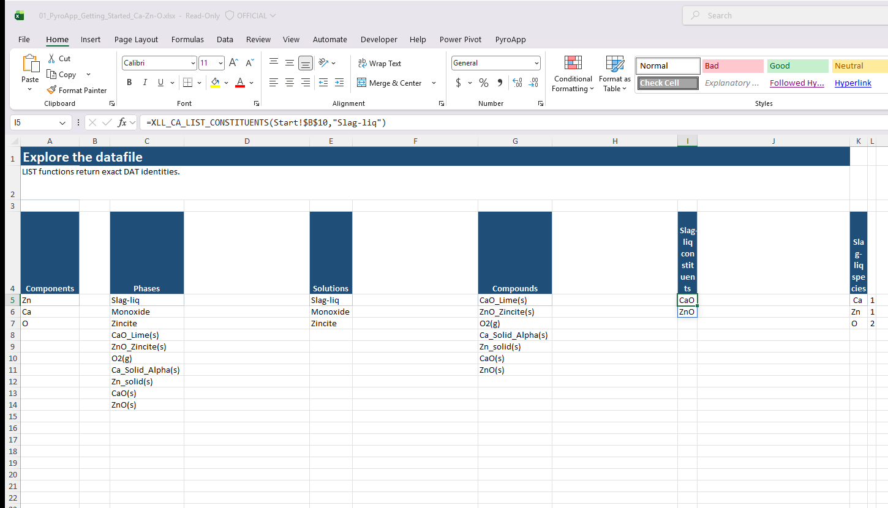

# Tutorial: explore a thermodynamic datafile

Before setting up an equilibrium calculation, find out what the datafile actually contains.

## Goal

You should be able to identify the system components, phases, solution phases, compounds, constituents and species whose exact names will be used later in calculation headers.

## 1. Put the datafile path in one cell

Put the path in `B2`, preferably workbook-relative:

```text
data\my-system.dat
```

## 2. List system components

```excel
=XLL_CA_LIST_COMPONENTS($B$2)
```

These are the system-component names used when an `IA` input is scoped to a system component.

## 3. List phases

```excel
=XLL_CA_LIST_PHASES($B$2)
```

Then separate the two useful classes:

```excel
=XLL_CA_LIST_SOLUTIONS($B$2)
```

```excel
=XLL_CA_LIST_COMPOUNDS($B$2)
```

A solution phase has variable composition. A compound phase has fixed stoichiometry.

## 4. Inspect one solution

If `E5` contains a phase returned by `XLL_CA_LIST_SOLUTIONS`:

```excel
=XLL_CA_LIST_CONSTITUENTS($B$2,E5)
```

```excel
=XLL_CA_LIST_SPECIES($B$2,E5)
```

If that solution has ordinary Gibbs-energy interaction records, list their exact parser identities too:

```excel
=XLL_CA_LIST_INTERACTIONS_G($B$2,E5)
```

Magnetic interactions are a separate, datafile-dependent family:

```excel
=XLL_CA_LIST_INTERACTIONS_M($B$2,E5)
```

Do not add an M-interaction formula merely as decoration. Some valid DAT files have no magnetic interaction records; when there are records, use the identity returned by the spill exactly as returned.

## 5. Inspect compound stoichiometry

If `H5#` is a spilled compound list:

```excel
=XLL_CA_GET_COMPOUND_WEIGHTS($B$2,H5#)
```

```excel
=XLL_CA_GET_COMPOUND_STOICHIOMETRY($B$2,H5#)
```

## Mental model

```text
datafile
  system components
  phases
    solution phases
      constituents / species
      interactions
    compound phases
```

The strings are datafile identities, not friendly labels. Reference the spilled cells directly when possible. The **Explore** and **Browse** sheets in the downloadable workbooks intentionally show the source LIST formula, its selected anchor, and the rows below it that receive the spill.

## Common problems

**#SPILL!** - clear the expected spill range.

**A typed phase name is rejected** - use the exact string returned by a LIST function.

**A CST does not expose editable parameters** - model-parameter LIST/GET/SET workflows are intended for open text DAT files.

## Next

Continue to [Convert composition bases](composition-basis.md), then [First equilibrium table](first-equilibrium.md).

## Read identities from a live DAT

The LIST anchor is selected in this real Excel capture. Use these spilled strings as inputs to later GET, SET, and CALCULATE calls; they are identifiers from the DAT, not display labels.



