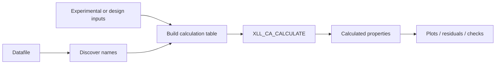
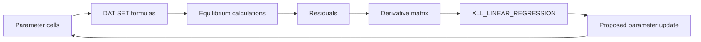

# Practical PyroApp tutorials

These tutorials are the recommended path for a chemical engineering student or researcher who wants to use PyroApp in Excel without writing code.

They are rebuilt from the original PyroApp examples and the Ca-Zn-Si-O continuous-optimization tutorial. The legacy files used Python, xlwings, workbook macros, and helper functions that are not part of PyroApp 2. The tutorials here use the current **XLL** interface only.

!!! important "PyroApp 2 workbooks do not need xlwings"
    Current formulas begin with `XLL_`. You do not need an `xlwings.conf` sheet, a Python interpreter, VBA macros, or the old xlwings add-in.

## Downloadable tutorial assets

The public [tutorial datafiles and Figure files](tutorial-assets.md) include the legacy teaching DAT systems that contain at most four chemical elements, together with the reference/target FIG files. CST files are deliberately excluded.

## Before you start

You need:

- PyroApp 2 installed for the same bitness as Excel;
- access to a licensed ChemApp runtime through the installed PyroApp configuration;
- a ChemApp datafile appropriate for the exercise;
- Excel with dynamic arrays.

Start with an open-text `.DAT` file when you want to inspect or modify thermodynamic parameters.

## Learning path

| Stage | Tutorial | What you learn |
| --- | --- | --- |
| 1 | [Explore a datafile](explore-datafile.md) | Components, phases, solutions, compounds, constituents and species |
| 2 | [Convert composition bases](composition-basis.md) | Convert reported compositions into the system basis |
| 3 | [First equilibrium table](first-equilibrium.md) | The three-row header and one `XLL_CA_CALCULATE` table |
| 4 | [Temperature and composition sweeps](equilibrium-sweep.md) | Run many independent equilibria in one formula and plot the result |
| 5 | [Phase appearance and boundaries](phase-boundaries.md) | Formation/precipitation targets and simple phase boundaries |
| 6 | [Inspect and edit model parameters](dat-parameters.md) | GET/SET compound, constituent and interaction parameters |
| 7 | [Simple optimization](optimization/index.md) | Residuals, Jacobian and parameter updates |
| 8 | [Ca-Zn-Si-O capstone](optimization/ca-zn-si-o.md) | Scale from binary subsystems to a multicomponent assessment |

## The spreadsheet pattern to learn

For optimization:

## Conventions used here

- Use exact names returned by LIST functions rather than typing phase identities from memory.
- In unused row-2/row-3 cells of a `CA_CALCULATE` header, enter `""`; do not leave the cells physically blank.
- Pass all similar independent rows to one `XLL_CA_CALCULATE` call. Old examples sometimes split tables manually for legacy threading; new workbooks should not.
- SET functions modify an open DAT in place. Work on a copy and keep a clean reference file.

## Mapping from the old examples

- example 01 -> composition-basis tutorial;
- examples 02/03/08 -> datafile discovery and information;
- example 04 -> equilibrium tables, sweeps and phase targets;
- example 05 -> DAT parameter inspection/editing;
- examples 06/07 -> replaced by normal Excel charts plus tabular PyroApp calculations;
- old optimization guide -> the optimization sequence and Ca-Zn-Si-O capstone.

The old `plot_data`, `calculate_binary`, generic `ca_list_interactions`, and Python `derivative_matrix` workflow are not part of the PyroApp 2 XLL course.
