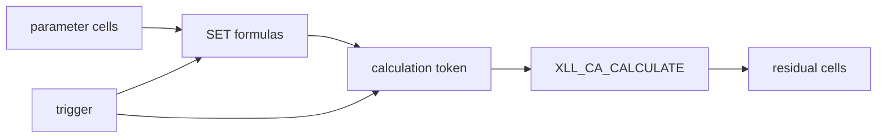

# Calculate an optimization derivative matrix

The derivative matrix (Jacobian) measures how every calculated target changes when each model parameter is perturbed.

The legacy workflow ran a Python/IPython `derivative_matrix` script. PyroApp 2 replaces it with **PyroApp -> Calculation -> Calculate derivative matrix**.

## 1. Build a parameter block

Create ordinary numeric cells for the model parameters you want to vary. These cells should be inert: they are the candidate parameter vector.

## 2. Wire parameter writes to one trigger

Create DAT SET formulas that read the parameter cells and depend on one numeric trigger cell through their update token.

For several SET formulas, create a downstream calculation token that depends on their results and on the trigger, then pass that token to `XLL_CA_CALCULATE`.

This explicit dependency is safer than giving unrelated SET and CALCULATE formulas only the same trigger.

## 3. Prepare numeric residual cells

The range read by the derivative command must be numeric at every evaluated state. Keep a separate validity mask for optimization rows that should later be excluded.

## 4. Configure B1:B6

| Cell | Meaning |
| --- | --- |
| `B1` | address of parameter range |
| `B2` | address of residual/output range |
| `B3` | address of one numeric trigger cell |
| `B4` | top-left derivative-matrix output cell |
| `B5` | blank for step 0.1, one scalar step, or address of per-parameter steps |
| `B6` | blank for all active, or address of Boolean/numeric parameter mask |

Parameters and residuals are flattened row by row.

## 5. Run the Ribbon command

Choose **PyroApp -> Calculation -> Calculate derivative matrix**.

PyroApp validates the configuration, evaluates the baseline, perturbs one active parameter at a time, writes completed derivative columns, then restores and recalculates the original parameter vector.

The result has one row per residual and one column per parameter.

## Calculation mode

The command temporarily forces PyroApp UDFs to Blocking but does not change Excel's Automatic/Manual calculation setting.

In Automatic mode PyroApp queues continuation work so it reads residuals only after the trigger-driven dependency calculation completes. In Manual mode it calculates the active worksheet once per state.

## Choose sensible steps

A derivative step must be larger than solver/numerical noise but small enough to remain local.

Inspect the completed matrix for:

- almost-zero columns;
- implausibly large/discontinuous values;
- targets that fail only after a perturbation;
- nearly proportional parameter columns.

These often expose modeling problems before regression does.

## Restoration

The command restores the original parameter vector on success, cancellation and failure, then performs a final trigger-driven calculation.

Do not externally edit the DAT while the transaction is running.

## Next

[Solve one linear parameter update](linear-update.md).

See also the full [derivative-matrix command contract](../../derivative-matrix.md).
