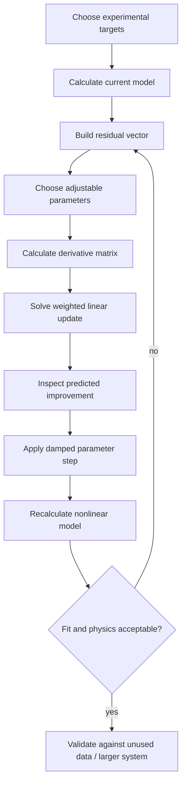

# Simple thermodynamic optimization

PyroApp's continuous-optimization workflow treats a thermodynamic assessment as a repeated local linear problem.

```text
residual = target - current
A = d(calculated values) / d(model parameters)
calculated_new ≈ calculated_current + A Δp
```

so locally:

```text
A Δp ≈ residual
```

## Start small

Do not begin by optimizing a large ternary database.

For learning, choose:

- one binary subsystem;
- one solution phase;
- 1-3 adjustable parameters;
- a small set of well-understood targets.

The Ca-Zn-O, Ca-Si-O and Zn-Si-O subsystems from the original tutorial are useful because they let you understand parameter effects before combining systems.

## Complete loop



## Tutorial sequence

1. [Targets, residuals and weights](targets-residuals.md)
2. [Calculate a derivative matrix](derivative-matrix.md)
3. [Solve and apply one linear update](linear-update.md)
4. [Select a small parameter combination](parameter-selection.md)
5. [Ca-Zn-Si-O capstone](ca-zn-si-o.md)

## Optimization is not only least squares

After every update check:

- phase topology and invariant equilibria;
- physically meaningful solution behavior;
- extrapolation outside fitted points;
- mixing functions where relevant;
- whether fitted parameters remain chemically plausible.

The optimizer proposes parameter values. The researcher remains responsible for the thermodynamic model.

## Workbook rule

Keep parameter cells as ordinary numeric cells. Make DAT SET formulas depend on a dedicated trigger cell, and make equilibrium calculations depend on completion of those SET formulas.

Continue to [Targets, residuals and weights](targets-residuals.md).
