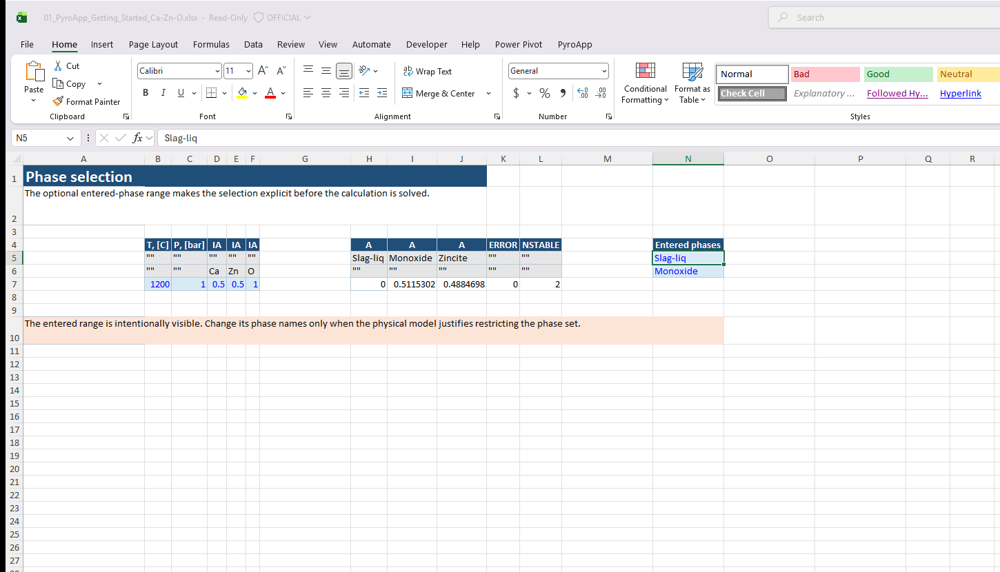

# Tutorial: phase appearance and simple boundaries

Many phase-diagram lines are phase-appearance boundaries. PyroApp can solve them directly instead of scanning temperature for a small phase amount.

## Formation and precipitation

**FORMATION** asks for the condition where a named child phase forms.

**PRECIPITATION** follows the precipitation-target convention and is useful when the mother-phase context is central.

FORMATION is usually the clearest starting point.

## Target-table pattern

A temperature-target input commonly contains:

- fixed `P`;
- `IA` columns for system-component amounts;
- a `FORMATION` column whose row value is the target phase name;
- optional `TLOW` and `THIGH` search limits.

For the FORMATION column, header rows 2 and 3 are `""`. The target phase name is in the **input row**.

Temperature is the default target variable. Add `VARIABLE` only when you intentionally solve another supported variable.

## Phase selection

Use the optional `entered` argument of `XLL_CA_CALCULATE` for the base phase selection.

For a simple liquidus target, it may be appropriate to enter the liquid and relevant solid phase. Row-local `ENTERED`, `DORMANT` and `ELIMINATED` controls can modify that base selection.

The workbook’s **Phase selection** sheet keeps the optional entered range at the right of the same calculation table. This is intentional: a reader can see which phase names are being constrained instead of treating the fifth argument as an invisible implementation detail.

## Request auditable outputs

Do not return only temperature. Also request:

- `ERROR`;
- `NSTABLE`;
- `A` or `AC` for participating phases;
- `XP` where solution composition matters.

A numerical root is not automatically the phase equilibrium you intended.

## Invariant points

At an invariant point all participating phases must be stable at the same solved condition.

Keep explicit phase-activity checks and/or `NSTABLE`. `NSTABLE` counts phases with activity greater than 0.9999.

If three phases are expected and only two are stable, the row is not a valid three-phase invariant target even if a temperature was returned.

## Build a boundary curve

1. create a composition grid;
2. convert it to the system-component basis;
3. put the desired formation phase in each row;
4. run one `XLL_CA_CALCULATE` table;
5. flag nonzero `ERROR` or failed stability checks;
6. plot solved temperature versus composition with Excel.

This is the PyroApp 2 replacement for the old `calculate_binary` plus `plot_data` workflow.

## Next

Read [Target calculations](target-calculation.md) for the full target vocabulary, then [Inspect and edit model parameters](dat-parameters.md).

## Make phase selection explicit

The entered-phase range is separate and visible beside the calculation output. Do not use this illustration as a reason to restrict phases in a real system unless that restriction is physically justified.

