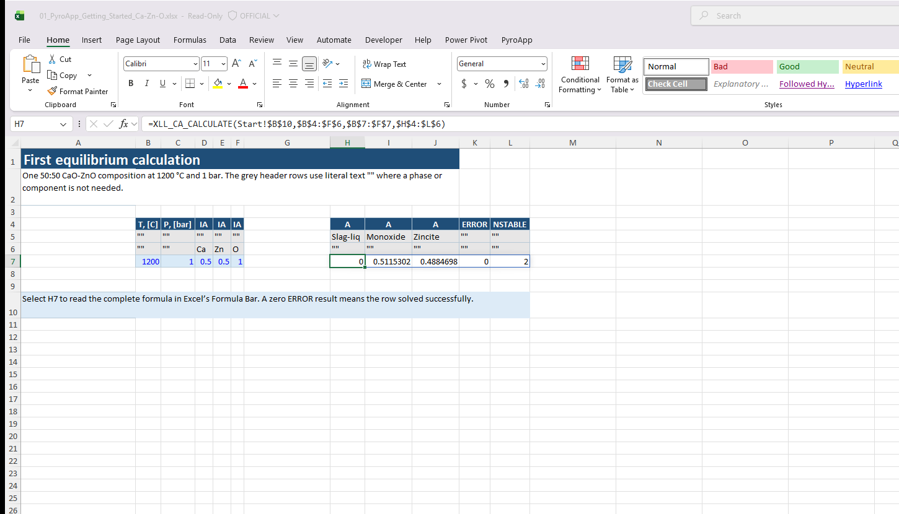
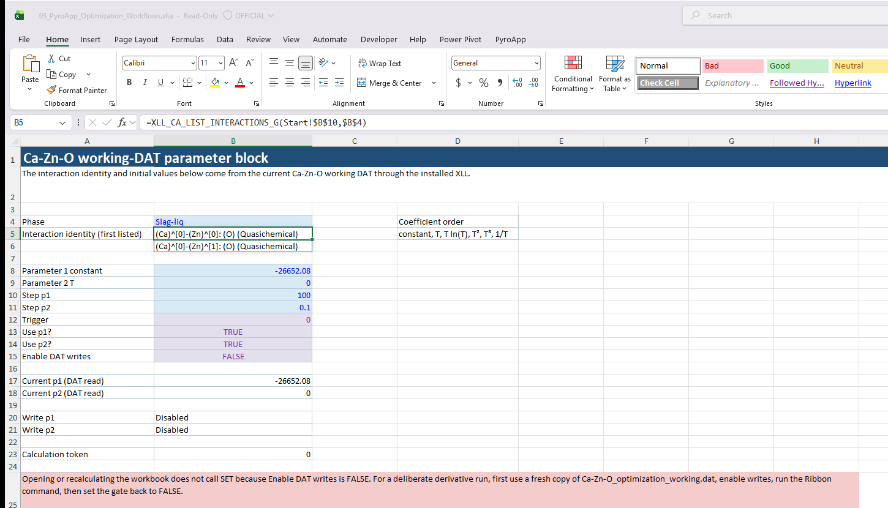
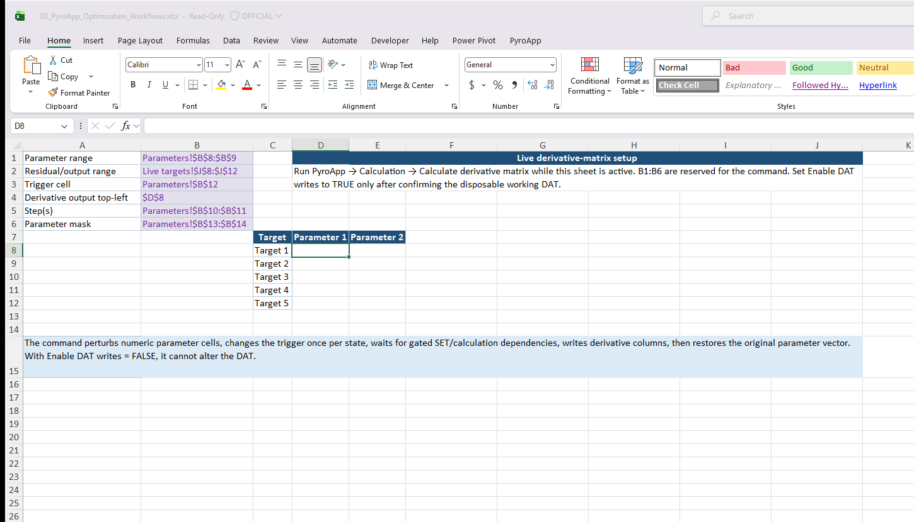
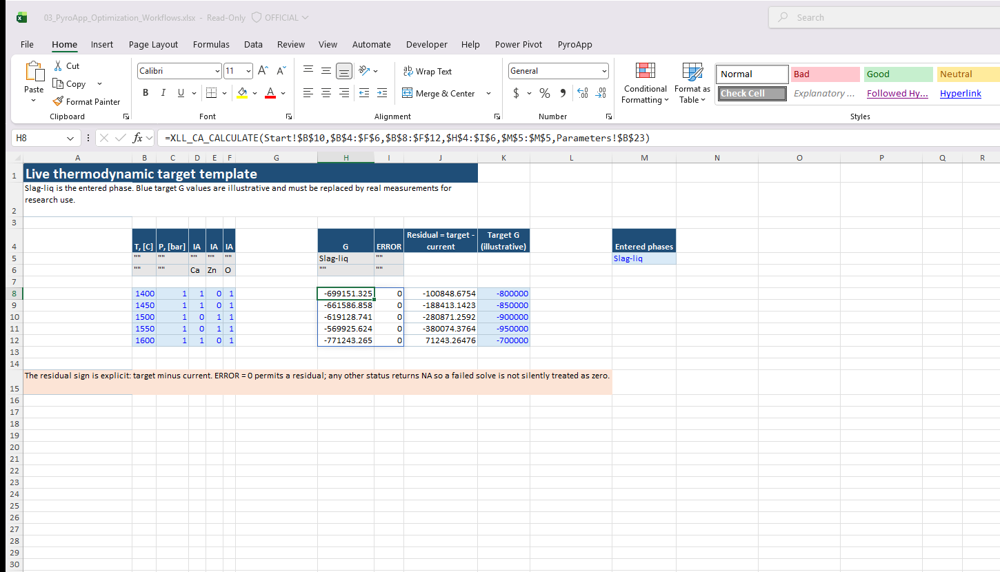
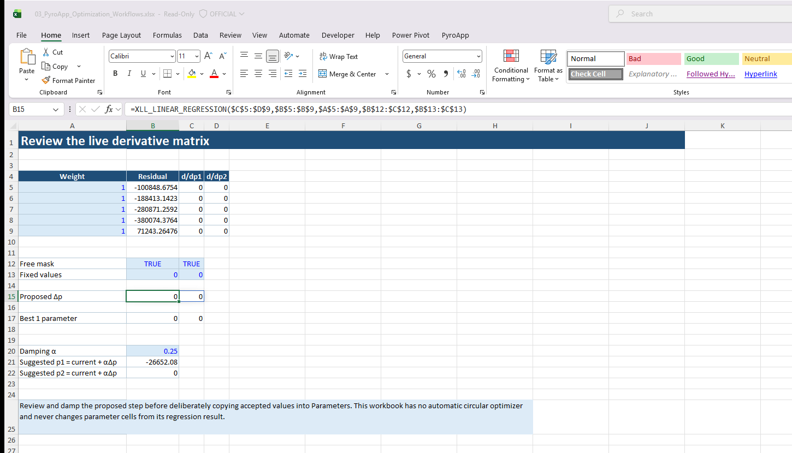

# Ready-to-use Excel workbooks

These workbooks are intended to be **downloaded, opened in desktop Excel, and edited**. They use the current `XLL_` PyroApp interface and contain no xlwings configuration, Python dependency, VBA macro, or legacy PyroApp formula names.

Maintainers generate layouts with `scripts/generate_example_workbooks.py`, then finalize them with `scripts/finalize_dynamic_excel_workbooks.ps1` in desktop Excel. That Windows step writes the modern dynamic-array metadata. The Excel-finalized XLSX files are committed artifacts. Linux documentation deployment never regenerates or rewrites them: it validates each XLSX container and requires the MkDocs site copy to have the same SHA-256 hash.

!!! important "Download the matching DAT too"
    A workbook cannot carry a ChemApp datafile inside an ordinary `.xlsx` file. Download the matching DAT file and place it in the **same folder** as the workbook. The Start sheet in every workbook repeats this instruction and contains a direct DAT download link.

## 1. Getting Started — Ca-Zn-O

[**Download 01_PyroApp_Getting_Started_Ca-Zn-O.xlsx**](../tutorial-assets/workbooks/01_PyroApp_Getting_Started_Ca-Zn-O.xlsx)

Matching datafile: [**Ca-Zn-O.dat**](../tutorial-assets/datafiles/examples/Ca-Zn-O.dat)

This is the recommended first workbook. It covers a broad cross-section of ordinary PyroApp use:

- ChemApp/runtime and licence diagnostics;
- DAT dimensions;
- lists of components, phases, solutions, compounds, constituents and species;
- component/compound property lookups;
- five `XLL_DATA_CHANGE_BASIS` cases: one row, multi-row spill, molar amounts, mass-to-mole amounts, and mole-to-mass fractions;
- `XLL_DATA_GENERATE_MESH`;
- a smallest-possible one-row `XLL_CA_CALCULATE` sheet with the Formula Bar anchor and literal `""` header markers;
- a multi-row equilibrium calculation;
- phase amounts and a phase composition output;
- normal Excel charts driven by calculation results;
- a temperature sweep;
- a dedicated phase-selection table with its visible entered-phase range;
- a `FORMATION` target calculation with search limits;
- `ERROR` and `NSTABLE` diagnostics.

The example uses literal `""` text in not-applicable header cells, with no leading equals sign.

The captures below are real desktop Excel windows using the installed PyroApp add-in. Each selected anchor is visible in the Formula Bar, including a one-row conversion, a multi-row spill, a LIST result, and a live equilibrium table.

## 2. DAT Inspection and Editing — Ca-Zn-O

[**Download 02_PyroApp_DAT_Inspection_and_Editing_Ca-Zn-O.xlsx**](../tutorial-assets/workbooks/02_PyroApp_DAT_Inspection_and_Editing_Ca-Zn-O.xlsx)

Baseline: [**Ca-Zn-O.dat**](../tutorial-assets/datafiles/examples/Ca-Zn-O.dat)

Working copy for this workbook: [**Ca-Zn-O_editing_working.dat**](../tutorial-assets/datafiles/examples/Ca-Zn-O_editing_working.dat)

This workbook is for learning how an **open DAT** is inspected and modified. It covers:

- LIST functions for DAT entities;
- compound H298, S298, molar mass, stoichiometry, range count, Tupper and coefficient access;
- solution-constituent equivalents;
- listing ordinary Gibbs-energy interactions;
- interaction indices;
- reading all six ordinary interaction coefficients;
- an intentionally gated `XLL_CA_SET_INTERACTION_PARAMETERS_G` example;
- use of an update token after a file edit.

The SET sheet is disabled by default. Download a fresh working copy of the DAT before enabling SET, so that the reference file remains untouched.

## 3. Optimization Workflows

[**Download 03_PyroApp_Optimization_Workflows.xlsx**](../tutorial-assets/workbooks/03_PyroApp_Optimization_Workflows.xlsx)

Baseline: [**Ca-Zn-O.dat**](../tutorial-assets/datafiles/examples/Ca-Zn-O.dat)

Working copy for this workbook: [**Ca-Zn-O_optimization_working.dat**](../tutorial-assets/datafiles/examples/Ca-Zn-O_optimization_working.dat)

This workbook has two layers.

The **Synthetic regression** sheet uses illustrative numerical data to teach the optimization helpers without depending on a thermodynamic calculation. It demonstrates:

- `XLL_LINEAR_REGRESSION`;
- `XLL_BEST_COMBINATION`;
- `XLL_PD_ERROR_TABLE`;
- the convention `residual = target - current`;
- predicted residuals from a local derivative matrix.

The live sheets then show the current DAT-connected workflow:

- ordinary numeric parameter cells;
- DAT SET formulas;
- a trigger and downstream calculation token;
- the B1:B6 configuration used by **PyroApp → Calculation → Calculate derivative matrix**;
- a live `XLL_CA_CALCULATE` target table;
- regression from the generated derivative matrix;
- a proposed parameter correction that is kept separate from the actual parameter cells.

The target Gibbs-energy values in the live template are deliberately labelled **illustrative**. They are there to demonstrate the mechanics of the optimization workflow; they are not presented as an assessed Ca-Zn-O experimental dataset.

## What these examples replace

The legacy example workbooks were extremely useful as a record of scientific workflows, but they depended on the old Python/xlwings implementation and contained features that should not be copied into a new workbook.

The downloadable examples above replace those mechanics with:

- compiled `XLL_` formulas;
- dynamic-array table outputs;
- ordinary Excel charts instead of `plot_data`;
- direct tabular phase-boundary calculations instead of `calculate_binary`;
- the Ribbon derivative-matrix command instead of the old Python/IPython derivative script;
- explicit DAT update dependencies;
- no `xlwings.conf` sheet and no macro requirement.

For the conceptual background, start with [What is PyroApp?](../learn/what-is-pyroapp.md). For a guided sequence explaining the sheets in these workbooks, return to the [Practical PyroApp tutorials](index.md).

## How the downloadable files are built

The committed XLSX bytes are the publishing authority. A maintainer runs the Python layout generator, then `scripts/finalize_dynamic_excel_workbooks.ps1` on Windows with the installed XLL. That finalizer uses disposable DAT siblings, verifies formula anchors and spills in real Excel, verifies write gates are false before saving, and removes the temporary DAT copies. The finalized XLSX files are committed. Linux Pages CI only validates the ZIP containers and copies the exact committed bytes into the site; it never regenerates a workbook.

## Optimization safety and provenance

The live example uses the Ca-Zn-O `Slag-liq` identity `(Ca)^[0]-(Zn)^[0]: (O) (Quasichemical)`, as returned by `XLL_CA_LIST_INTERACTIONS_G`. Its initial constant and temperature coefficients are read from the Ca-Zn-O working DAT as `-26652.080` and `0.0`. The visible `Enable DAT writes` control is saved as `FALSE`; both SET formulas are gated by it. The derivative command therefore has a visible parameter → gated SET → calculation token → calculation → residual → derivative matrix → regression path, but applying a proposed damped update remains a separate user choice.

